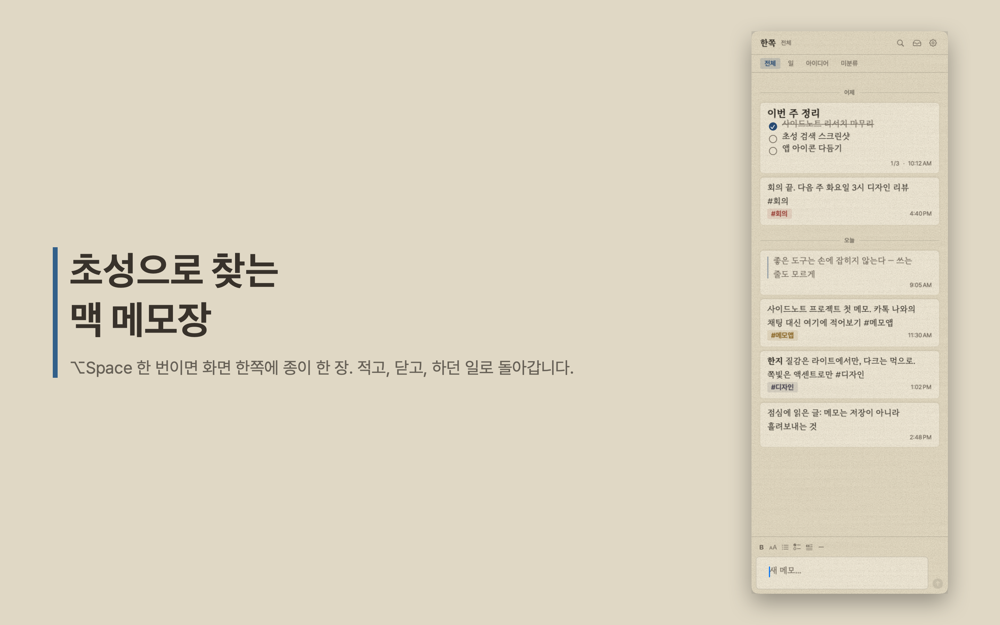

# 한쪽 (Hanjjok)

**초성으로 찾는 맥 메모장.** `ㅅㅇㄷ`를 치면 "사이드노트"가 나오고, `사이ㄷ`처럼 조합 중인 글자로도 결과가 끊기지 않습니다.

카카오톡 '나와의 채팅'에 메모하던 습관을 Mac 메뉴바로 옮겼습니다. `⌥Space`를 누르면 화면 한쪽에서 종이 한 장이 미끄러져 나오고, 적고, `Esc`로 닫으면 하던 일로 돌아갑니다.

> Mac App Store 출시 준비 중. 무료.



## 하는 것

- **초성·부분 검색** — 한글 조합 중에도 결과가 유지됩니다 (자모 분해 인덱싱)
- **시간순 타임라인** — 폴더 계층 없이 위에서 아래로 쌓입니다
- `#태그` 분류, 1단계 폴더
- 가벼운 마크다운 — 제목·굵게·인용·불릿·체크리스트, 카드에서 바로 완료 토글
- 라이트는 한지, 다크는 먹 — 시스템 설정 추종
- 본문 글꼴 마루부리 / Pretendard 전환
- 전체 메모 마크다운 내보내기 — 락인 없음

## 안 하는 것

- 계정, 서버, 동기화, 광고, 분석. **네트워크에 연결하지 않습니다.**
- 모든 메모는 이 Mac의 샌드박스 컨테이너 안에만 있습니다. → [개인정보처리방침](docs/privacy.md)

## 빌드

macOS 14+, Xcode 16+, [XcodeGen](https://github.com/yonaskolb/XcodeGen).

```bash
xcodegen generate
xcodebuild -project Hanjjok.xcodeproj -scheme Hanjjok -configuration Debug -derivedDataPath build build
open build/Build/Products/Debug/Hanjjok.app
```

패키지 테스트:

```bash
swift test --package-path Packages/Domain
swift test --package-path Packages/Data
```

## 구조

```
Hanjjok/           앱 타깃 — SwiftUI 뷰, @Observable 뷰모델, 에셋
Packages/Domain    순수 Swift — 파서·인덱서·검색 질의 (프레임워크 import 없음)
Packages/Data      GRDB(SQLite) 저장소 구현
Packages/PanelKit  AppKit 격리 — NSPanel, 메뉴바
docs/              스펙·계획서·QA 체크리스트·스토어 스크린샷
tools/screenshots  스토어 스크린샷 생성 도구 (DEBUG 스냅샷 훅 + 시드 + 합성)
```

## 서드파티

- [GRDB.swift](https://github.com/groue/GRDB.swift) — MIT
- [KeyboardShortcuts](https://github.com/sindresorhus/KeyboardShortcuts) — MIT
- [MaruBuri](https://hangeul.naver.com/font) (NAVER), [Pretendard](https://github.com/orioncactus/pretendard) — SIL OFL 1.1, 라이선스 전문은 `Hanjjok/Resources/Fonts/LICENSE.txt`

## 라이선스

소스 코드 라이선스는 추후 명시합니다.
